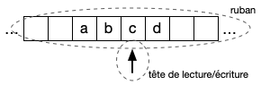
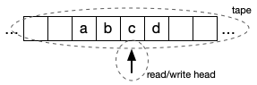

[English version below]

# Simulation de machines de Turing

## Description générale

Les machines de Turing sont une construction abstraite, très utilisée en
informatique théorique, notamment pour l'étude de la complexité et de la
calculabilité. Dans ce cours, on ne s'intéresse cependant pas à leurs
utilisations théoriques, mais seulement à leur représentation et simulation en
Python.

Il existe plusieurs définitions, équivalentes, d'une machine de Turing. Nous en
retenons ici une qui permet une expression plus compacte, et qui est plus
naturellement exprimable en Python.

Une machine de Turing effectue ses calculs en lisant et écrivant des caractères
sur un ruban infini, découpé en cases. Une tête de lecture/écriture pointe sur une des
cases du ruban et permet de lire et écrire le caractère de la case pointée. Une
machine se trouve en outre à chaque étape de son exécution dans un état donné et
l'exécution d'un pas de calcul dépend de cet état et peut le modifier.



Plus précisément, une machine de Turing peut être définie par :

- un alphabet, qui est l'ensemble des caractères qui peuvent apparaître dans une
  des cases du ruban (un caractère particulier, en général appelé *blanc*, est
  distingué pour représenter le fait qu'une case est *vide*) ;
- un ensemble de symboles (ou noms), qui représente les états dans lesquels la
  machine peut se trouver (on distingue un état particulier, l'état initial, et
  un sous-ensemble des états qui constitue les états acceptants) ;
- une fonction de transition qui permet de calculer un pas d'exécution, et est
  une fonction partielle qui prend en paramètre un état et un caractère et renvoie
  un triplet dont les composantes sont un état, un caractère et un mouvement
  (la tête de lecture/écriture se déplace vers la gauche, la droite, ou reste immobile).

Pour effectuer un pas de calcul, on utilise la fonction de transition. On lui
passe l'état courant et le caractère qui se trouve sous la tête de
lecture/écriture, et on utilise le triplet qu'elle retourne pour mettre à jour
la machine. Son nouvel état est l'état retourné, le caractère sous la tête de
lecture/écriture est modifié pour prendre la valeur du caractère retourné, et
enfin la tête se déplace comme indiqué.

L'exécution de la machine commence avec un mot initial (*i. e.* une liste
contiguë de caractères non blancs) sur le ruban, la tête de lecture/écriture
placée sur le caractère le plus à gauche, et dans l'état initial. Toutes les
autres cases contiennent le caractère blanc.

L'exécution de la machine continue, pas à pas, jusqu'à se trouver dans un état
acceptant ou que la fonction de transition (qui est partielle) ne soit pas
définie pour la configuration courante. Dans ce dernier cas, l'exécution
s'arrête sur une erreur.


## Représentation en Python

En ce qui concerne l'alphabet de la machine, nous allons simplement considérer
qu'il est constitué des caractères alphanumériques et espaces et allons
représenter le *blanc* par `None`. Ainsi le contenu de l'une des cases du ruban
est-il de type `Optional[str]`.

Pour représenter le ruban, nous allons utiliser une valeur de type `list`. À
chaque instant, cette liste est de longueur finie, mais nous pouvons modifier sa
taille en ajoutant des éléments sur la gauche ou sur la droite lorsque
nécessaire. Le type complet du ruban est donc `list[Optional[str]]`.

Pour les états, nous allons utiliser des chaînes de caractères, en supposant
qu'il s'agit d'identifiants (caractères alphanumériques et soulignés, absence
d'espaces).

Enfin, pour représenter la fonction de transition, nous allons utiliser un
dictionnaire. Puisque la fonction prend deux paramètres, un état et un élément
de l'alphabet, le type des clefs sera `tuple[str, Optional[str]]`. Puisque la
fonction retourne trois valeurs, un état, un élément de l'alphabet, et un mouvement,
le type des valeurs sera `tuple[str, Optional[str], Move]`. `Move` est défini de
la manière suivante :

```python
class Move(enum.Enum):
    LEFT = "left"
    NONE = "none"
    RIGHT = "right"
```

À ce point du cours, on se contente de considérer qu'une valeur de type `Move`
peut prendre uniquement l'une des trois valeurs suivantes : `Move.LEFT`,
`Move.NONE`, ou `Move.RIGHT`. Nous discuterons les détails de la déclaration
ci-dessus dans une prochaine séance.


## Exemples d'exécution

Considérons les déclarations suivantes :

```python
STATES: set[str] = {"done", "propagate-carry", "rightmost-digit"}

START_STATE = "rightmost-digit"

ACCEPTING_STATES: set[str] = {"done"}

TRANSITIONS: dict[tuple[str, Optional[str]], tuple[str, Optional[str], Move]] = {
    ("rightmost-digit", "0"): ("rightmost-digit", "0", Move.RIGHT),
    ("rightmost-digit", "1"): ("rightmost-digit", "1", Move.RIGHT),
    ("rightmost-digit", None): ("propagate-carry", None, Move.LEFT),
    ("propagate-carry", "0"): ("done", "1", Move.NONE),
    ("propagate-carry", "1"): ("propagate-carry", "0", Move.LEFT),
    ("propagate-carry", None): ("done", "1", Move.NONE),
}
```

Si l'on exécute la machine en partant du mot "101", les étapes d'exécution
seront :

```
+---+---+---+
| 1 | 0 | 1 | rightmost-digit
+---+---+---+
  ^

+---+---+---+
| 1 | 0 | 1 | rightmost-digit
+---+---+---+
      ^

+---+---+---+
| 1 | 0 | 1 | rightmost-digit
+---+---+---+
          ^

+---+---+---+---+
| 1 | 0 | 1 | ~ | rightmost-digit
+---+---+---+---+
              ^

+---+---+---+---+
| 1 | 0 | 1 | ~ | propagate-carry
+---+---+---+---+
          ^

+---+---+---+---+
| 1 | 0 | 0 | ~ | propagate-carry
+---+---+---+---+
      ^

+---+---+---+---+
| 1 | 1 | 0 | ~ | done
+---+---+---+---+
      ^
```

où `~` est utilisé pour représenter une case vide du ruban.

Si l'on part du mot "111", les étapes seront :

```
+---+---+---+
| 1 | 1 | 1 | rightmost-digit
+---+---+---+
  ^

+---+---+---+
| 1 | 1 | 1 | rightmost-digit
+---+---+---+
      ^

+---+---+---+
| 1 | 1 | 1 | rightmost-digit
+---+---+---+
          ^

+---+---+---+---+
| 1 | 1 | 1 | ~ | rightmost-digit
+---+---+---+---+
              ^

+---+---+---+---+
| 1 | 1 | 1 | ~ | propagate-carry
+---+---+---+---+
          ^

+---+---+---+---+
| 1 | 1 | 0 | ~ | propagate-carry
+---+---+---+---+
      ^

+---+---+---+---+
| 1 | 0 | 0 | ~ | propagate-carry
+---+---+---+---+
  ^

+---+---+---+---+---+
| ~ | 0 | 0 | 0 | ~ | propagate-carry
+---+---+---+---+---+
  ^

+---+---+---+---+---+
| 1 | 0 | 0 | 0 | ~ | done
+---+---+---+---+---+
  ^
```

On voit donc que le *programme* de la machine de Turing permet de calculer
le successeur d'un entier en représentation binaire.


## Étape 1 - initialisation et affichage

On représente la configuration courante d'une machine à l'aide du type suivant :

```python
Machine = tuple[list[Optional[str]], int, str]
```

c'est-à-dire :

- ruban ;
- position de la tête de lecture/écriture, comme indice dans le ruban ;
- état courant.

Écrire dans le fichier [turing.py](./turing.py) le corps de la fonction
`init_machine` qui initialise une machine à partir d'un mot reçu en paramètre.
Écrire ensuite le corps de la fonction `print_machine`, qui suit le format des
exemples d'exécution ci-dessus. Le ruban est affiché case par case dans des
carrés en utilisant les caractères `+`, `-` et `|`, avec `~` pour la case vide :

```
+---+
| ~ |
+---+
```

Outre le ruban, on affiche en fin de ligne l'état et on matérialise la position
de la tête de lecture/écriture via le caractère `^` sous le ruban.

Ces deux fonctions écrites, vérifier manuellement qu'elles produisent l'effet
attendu sur les mots "101" et "111".


## Étape 2 - pull request

*(copié de la séance #1)*

Tous les changements apportés aux fichiers dans VS Code en ligne sont éphémères
(*i. e.* seront perdus lorsque la machine virtuelle sera détruite). Pour les
sauvegarder de manière durable, il faut non seulement effectuer un `git commit`,
mais également un `git push` afin de "pousser" les modifications vers le dépôt.

Une fois que les modifications ont été poussées, elles sont visibles sur la page
web du dépôt. Pour les partager (par exemple pour rendre un TP), il est
possible d'ouvrir une *pull request* en cliquant sur "Contribute" puis
"Open pull request" :


Vous pouvez alors confirmer la création de la *pull request* :


et consulter son *diff* :


## Étape 3 - exécution

Pour simuler l'exécution d'une machine, on va implémenter deux fonctions,
`step_machine` et `run_machine`, chargées respectivement d'un pas d'exécution et
de l'exécution complète. Ces deux fonctions prennent en paramètre une valeur de
type `Machine`. La première renvoie une valeur de type `Optional[Machine]`
(nouvelle configuration de la machine), tandis que la seconde renvoie une valeur
de type `Optional[str]` (résultat de l'exécution). Elles doivent retourner la
valeur `None` si une erreur se produit, c'est-à-dire s'il n'existe pas de
transition pour la configuration courante. La fonction `run_machine` doit
afficher les configurations successives de la machine comme dans les exemples
ci-dessus.

Écrire ces deux fonctions et exécuter la machine sur les mots "101" et "111" pour
vérifier que les traces produites sont conformes à celles des exemples ci-dessus.


## (Optionnel) Étape 4 - vérifications

On peut se poser la question de la validation d'une machine avant de commencer son
exécution. Par exemple, l'état initial doit faire partie de l'ensemble des états,
et les états acceptants doivent être un sous-ensemble de l'ensemble des états.

D'autres conditions peuvent être vérifiées sur les transitions, et sur le mot
initialement écrit sur le ruban. Implémenter une fonction `check_machine` qui
vérifie quelques conditions qui permettent d'assurer que la machine est bien
formée. Quelle est la signature (*i. e.* types des paramètres et type de retour)
de la fonction ?


# Turing machine simulation

## Description

Turing machines are an abstract construction, largely used in Computer
Science, in particular for the theoretical study of complexity and computability.
In this course, we are, however, not interested in their theoretical uses, but
only in the representation and simulation in Python.

There are several equivalent definitions of Turing Machines. The one used
below allows for a compact expression, and is easily translated to Python.

A Turing machine computes by reading and writing characters on an
infinite tape, divided into cells. The reading/writing head points to one of
the tape cells, and can read and write the character of the pointed cell.
A machine is also always in a given state, and the execution of a computation
step depends on this state and can change it.



More precisely, a Turing machine can be defined through:

- an alphabet, which is the set of characters that can appear in a tape cell
  (a character, usually named "blank", is distinguished to represent the fact
  that a cell is *empty*);
- a set of symbols (or names), which represents the possible states of the
  machine (we distinguish a particular state, the start state, and a subset of
  the states which are the accepting states) ;
- a transition function which is used to compute a step, and is a partial
  function from a state/character pair to a state/character/move triple
  (the head moves left, right, or stays on the same cell).

To compute a step, we use the transition function. We pass it the current
state and the character under the read/write head, and we use the returned
triple to update the machine. Its new state is the one returned, the character
under the read/write head is changed to become the returned one, and the
head moves as indicated.

The execution of the machine starts with an initial word (*i.e.* a contiguous
list of non-blank characters) on the tape, the read/write head pointing to the
leftmost character, and in the start state. All the other cells contain a
blank character.

The execution continues, step by step, until the machine reaches an
accepting state, or the transition function (which is partial) is not defined for
the current configuration. In the latter case, the execution stops on a failure.


## Python representation

For the alphabet, we will simply use the set containing the alphanumerical
characters, spaces, and will use `None` to represent the *blank* character.
The type of a tape cell is thus `Optional[str]`.

For the tape, we will use the `list` type. At each step, this list is finite, but we
can change its size by adding elements on the left or on the right as needed.
The type of a tape is thus `list[Optional[str]]`.

For the states, we will use strings, assuming they represent identifier
(alphanumerical characters, underscores, with no whitespace).

Finally, to represent the transition function, we will use a dictionary. Since the
function takes two parameters, a state and an element from the alphabet,
the type of the keys will be `tuple[str, Optional[str]]`. Since the function returns
three values, a sate, an element from the alphabet, and a move, the type of
the values will be `tuple[str, Optional[str], Move]`. `Move` is defined as follows:

```python
class Move(enum.Enum):
    LEFT = "left"
    NONE = "none"
    RIGHT = "right"
```

At this point of the course, we will assume that a value of type `Move` can have
one of the three following values: `Move.LEFT`, `Move.NONE`, ou `Move.RIGHT`.
We will discuss the details of the declaration above in a future session.


## Execution examples

Let's consider the following declarations:

```python
STATES: set[str] = {"done", "propagate-carry", "rightmost-digit"}

START_STATE = "rightmost-digit"

ACCEPTING_STATES: set[str] = {"done"}

TRANSITIONS: dict[tuple[str, Optional[str]], tuple[str, Optional[str], Move]] = {
    ("rightmost-digit", "0"): ("rightmost-digit", "0", Move.RIGHT),
    ("rightmost-digit", "1"): ("rightmost-digit", "1", Move.RIGHT),
    ("rightmost-digit", None): ("propagate-carry", None, Move.LEFT),
    ("propagate-carry", "0"): ("done", "1", Move.NONE),
    ("propagate-carry", "1"): ("propagate-carry", "0", Move.LEFT),
    ("propagate-carry", None): ("done", "1", Move.NONE),
}
```

If we execute the machine, starting from the word "101", the execution steps
will be:

```
+---+---+---+
| 1 | 0 | 1 | rightmost-digit
+---+---+---+
  ^

+---+---+---+
| 1 | 0 | 1 | rightmost-digit
+---+---+---+
      ^

+---+---+---+
| 1 | 0 | 1 | rightmost-digit
+---+---+---+
          ^

+---+---+---+---+
| 1 | 0 | 1 | ~ | rightmost-digit
+---+---+---+---+
              ^

+---+---+---+---+
| 1 | 0 | 1 | ~ | propagate-carry
+---+---+---+---+
          ^

+---+---+---+---+
| 1 | 0 | 0 | ~ | propagate-carry
+---+---+---+---+
      ^

+---+---+---+---+
| 1 | 1 | 0 | ~ | done
+---+---+---+---+
      ^
```

where `~` is used to represent an empty cell of the tape.

If we start from the word "111", the steps will be:

```
+---+---+---+
| 1 | 1 | 1 | rightmost-digit
+---+---+---+
  ^

+---+---+---+
| 1 | 1 | 1 | rightmost-digit
+---+---+---+
      ^

+---+---+---+
| 1 | 1 | 1 | rightmost-digit
+---+---+---+
          ^

+---+---+---+---+
| 1 | 1 | 1 | ~ | rightmost-digit
+---+---+---+---+
              ^

+---+---+---+---+
| 1 | 1 | 1 | ~ | propagate-carry
+---+---+---+---+
          ^

+---+---+---+---+
| 1 | 1 | 0 | ~ | propagate-carry
+---+---+---+---+
      ^

+---+---+---+---+
| 1 | 0 | 0 | ~ | propagate-carry
+---+---+---+---+
  ^

+---+---+---+---+---+
| ~ | 0 | 0 | 0 | ~ | propagate-carry
+---+---+---+---+---+
  ^

+---+---+---+---+---+
| 1 | 0 | 0 | 0 | ~ | done
+---+---+---+---+---+
  ^
```

We hence see that the *program* of the Turing machine computes the
successor of an integer written using the binary representation.


## Step 1 - initialization and display

We represent the configuration of a machine with the following type:

```python
Machine = tuple[list[Optional[str]], int, str]
```

the components being:

- the tape;
- the read/write head, as an index in the tape;
- the state.

Write in the [turing.py](./turing.py) file the body of the `init_machine` function
which initializes the machine from a word passed as a `str` parameter.
Then write the body of the `print_machine` function, which follows the format
of the examples above. The tape is displayed cell by cell in squares, using the
`+`, `-` and `|` characters, with `~` for the empty cell:

```
+---+
| ~ |
+---+
```

In addition to the tape, we display at the end of the line the state, and show
the position of the read/write head through the `^` character below the tape.

Once these two functions are written, manually check they produce the
expected effect on the "101" and "111" words.


## Step 2 - pull request

*(copied from session #1)*

All the changes made to files in the online version of VS Code are ephemeral
(*i.e.* will be lost when the virtual machine will shut down). In order to
properly saves our changes, we have to `git commit` the changes *and also*
execute `git push` to "push" the changes to the repository.

Once the changes have been pushed, they can be seen on the web page of
the repository. In order to share them (for instance to submit your work at the
end of a session), you can open a *pull request* by clicking "Contribute" and
then "Open pull request":


You can then confirm you want to create a pull request:


and check its *diff*:


## Step 3 - exécution

In order to simulate the execution of a machine, we will implement two functions,
namely `step_machine` and `run_machine`, to respectively compute a single step
and to execute the machine until it stops. Both function take a value of type
`Machine` as their only parameter. The first function returns a value of type
`Optional[Machine]` (new configuration of the machine). The second function
returns a value of type `Optional[str]` (execution result). Both must return `None`
if an error occurs, *i.e.* if there is no transition for the current configuration.
The `run_machine` function must display the successive configurations of the
machine as in the examples above.

Write both functions, and execute the machine on the "101" and "111" word
to check the produced traces are similar to the ones above.


## (Optional) Step 4 - checks

We may want to validate a machine before executing it. For instance, the
start state must appear in the set of all possible states, and the accepting states
must be a subset of all the states.

Other conditions may be checked on the transitions, and on the word initially
written on the tape. Implement a `check_machine` function, which checks a
couple of conditions ensuring that the machine is well formed. What is the
signature (*i.e.* parameter and return types) of the function?

